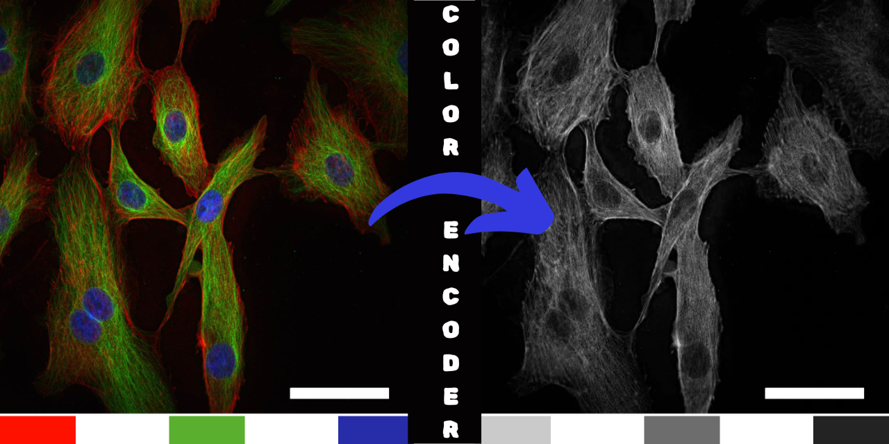

# ColorEncoder

ColorEncoder is a Python-based application that converts images into height maps based on color channel contributions. It also generates histograms of pixel values from the height map for analysis.

## Features

- Load an image into the application and display it on the left side of the canvas
- Convert images into height maps based on color channel contributions, displayed on the right side
- Generate and display real-time histograms of pixel values from the height map
- Save both height maps and histograms as PNG files
- User-friendly interface with intuitive controls
- Support for various image formats (PNG, JPG, BMP)

## Installation

Ensure you have Python installed (version 3.6 or higher). Install the required dependencies using:

```bash
pip install -r requirements.txt
```

Required dependencies:
- Pillow>=9.0.0
- numpy>=1.21.0
- matplotlib>=3.4.0
- tkinter (usually comes with Python)

## Usage

Run the application using:

```bash
python ColorEncoder.py
```

### Workflow

1. **Load an Image**
   - Click the "Load Image" button to select an image from your device
   - The selected image will appear on the left side of the canvas
   - Supported formats include PNG, JPG, and BMP

2. **Height Map Generation**
   - The height map is automatically generated upon image loading
   - The conversion process considers RGB channel contributions
   - Results are displayed in real-time on the right side of the canvas

3. **Histogram Analysis**
   - A histogram of height map pixel values is automatically generated
   - The histogram updates in real-time with any changes
   - Provides statistical insight into the height distribution

4. **Save Results**
   - Use "Save Height Map" to export the generated height map as PNG
   - Use "Save Histogram" to export the visualization as PNG
   - Files are saved with timestamped filenames to prevent overwrites

## Example Output

When processing an image, you'll see:
- Original image (left)
- Generated height map (right)
- Pixel value histogram (below)

## Contributing

Contributions are welcome! Please feel free to submit a Pull Request.

## License

This project is licensed under the MIT License - see the LICENSE file for details.
